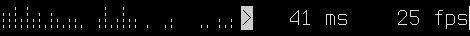

# Term PA Spectrum

**Term PA Spectrum** is a simple program to display the spectrum of the sound
stream that is playing through PulseAudio in the terminal with unicode characters.  
It offers several configuration options, such as frequencies to use, sample
size, sample rate... and output options such as charset to use, different
aggregation functions, different trigger levels...  

A widget for awesomewm 4.0 is included

## Getting Started

Just clone and run it. Needs the fftw3 and pulse libraries to compile
(libpulse-dev libfftw3-dev on debian-based distros).
```
git clone https://github.com/Kuroneer/term_pa_spectrum
cd term_pa_spectrum
make run
```


# Screenshots




## Authors

* **Jose M Perez Ramos** - [Kuroneer](https://github.com/Kuroneer)

## License

This project is released under the GPLv3. Check [LICENSE](LICENSE) for more information.

